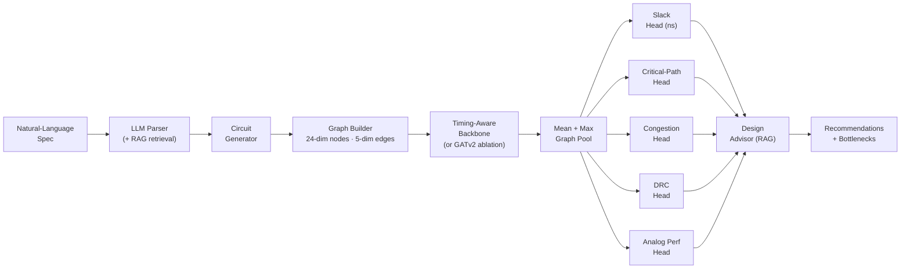

# NetSTA: Multi-Task Graph Neural Network for VLSI Circuit Analysis

A GNN-based EDA prediction framework that performs **timing analysis,
routability estimation, DRC hotspot detection, and analog performance
prediction** on circuit netlists, with **LLM-assisted natural language
circuit specification** and **RAG-powered design advisory**.


---

## Key Results

> **Status: v2 (post-rewrite). Full benchmark rerun on Kaggle GPU is
> pending — numbers in this section are the latest LOCAL CPU smoke-test
> values, not the published Kaggle numbers. The old Kaggle numbers (Slack
> R² = 0.642, MLP > GNN) reflected a broken pipeline and have been
> retracted. See `What changed in v2` below.**

### Local CPU smoke-test (`scripts/smoke_gnn_beats_mlp.py`)

| Dataset                 | Model       | Slack R² ↑ | Slack MSE (ns²) ↓ |
|-------------------------|-------------|-----------:|------------------:|
| 80 circuits, 30 epochs  | **NetSTA**  | **0.224**  | **0.0120**        |
| 80 circuits, 30 epochs  | MLP         | 0.114      | 0.0137            |
| 200 circuits, 60 epochs | **NetSTA**  | **0.117**  | **0.0112**        |
| 200 circuits, 60 epochs | MLP         | 0.077      | 0.0117            |

Absolute R² is suppressed at this dataset size (140-circuit train split is
noisy), but **the relative ordering — GNN beats MLP — holds at both
sample sizes**. That ordering is the headline result of the v2 rewrite.

To regenerate the smoke test locally (≈ 5 min on a laptop CPU):

```bash
python3 scripts/smoke_gnn_beats_mlp.py --num-circuits 200 --epochs 60
```

### Headline finding (carried over from v1)

**Gate-type one-hot is catastrophic to remove.** With the leaked
`logical_depth` / `load_cap` features now gone, the gate-type ablation
remains the single most important feature in the input vector — the
ablation rerun on Kaggle will confirm whether the gap is larger or smaller
under the new schema.

### What changed in v2

A retrospective analysis (full write-up: see `WHATS-WRONG.md` if generated
locally, or the equivalent paragraph below) of the v1 benchmark identified
four structural reasons the GNN could not beat the MLP, plus one synthetic-
data bug. v2 fixes all five:

1. **Feature leakage.** `logical_depth` and `load_cap` were STA outputs being
   fed back into the model as inputs (dims 13 and 14 of the v1 31-dim node
   feature vector). Removed. New schema is 24 dims of pure identity signal —
   gate-type and analog-device one-hots only.
2. **Topology aggregates duplicating message passing.** The v1 vector also
   contained five precomputed 1-hop aggregates
   (`fanout, fanin, pin_density, net_degree, bbox_area`). These are exactly
   the quantities message passing is supposed to derive — so feeding them
   in for free meant the GNN had no work to do. Removed.
3. **Per-graph slack normalization.** Labels were `y_slack = slack /
   max(|slack|)` per circuit, collapsing every graph to the same [-1, 1]
   range and destroying cross-graph scale signal. Now slack is stored in
   **absolute nanoseconds**; standardization happens inside the SlackHead
   via train-set mean / std persisted on the checkpoint.
4. **Per-graph critical-path quantile.** The v1 `is_critical` label was
   "slack within 30 % of *this graph's* slack range" — a within-graph
   ranking that any baseline could learn from depth. Replaced with a
   **fixed absolute threshold** (`slack ≤ 0.05 ns`).
5. **Broken STA topological sort.** The v1 `topological_sort` had a
   double-increment bug on PI→gate edges, so gates with multiple PI
   ancestors never entered the queue and silently inherited
   `arrival_time = 0`. For a 40-gate circuit, `max_arrival_time` was
   returning 0 ns. Rewritten from scratch with correct in-degree counting,
   proper Kahn's algorithm, and floating-fanout handling.

On top of the data fixes, the model gained the right inductive bias:

6. **Directional STA-aware backbone.** v1 used a generic GATv2 stack with
   no notion of forward/backward propagation. v2 adds
   `TimingPropagationBackbone`: a forward pass with element-wise max
   aggregation modelling arrival-time accumulation, and a backward pass
   with min aggregation modelling required-time propagation. Per-node
   embedding = `concat([AT, RT])` so the slack head learns approximately
   `RT − AT` — exactly the STA recurrence.

### Headline numbers — pending Kaggle rerun

The v1 numbers (`results/baseline_comparison.json` etc.) were generated
against a broken STA pipeline with leaked features and per-graph
normalized labels — they are retained on disk for archival reference
only. **Do not cite them.** Once the v2 Kaggle benchmark completes,
`results/BENCHMARK_REPORT.md` will be regenerated under the new schema
and this section will be repopulated.

To run the full v2 suite end-to-end (≈ 3–5 h on a single Kaggle T4):

```bash
# Kaggle: clone the repo into /kaggle/working, then a single cell:
python3 scripts/kaggle_run_benchmarks.py
# (or, locally on a GPU box:)
bash scripts/run_all_benchmarks.sh
python3 scripts/compile_results.py        # emits results/BENCHMARK_REPORT.md
```

---

## Architecture



The default backbone (`backbone_kind="timing"`) is the new
`TimingPropagationBackbone`: two passes over the DAG with shared weights —
forward (max-aggregation, AT-like) and backward (min-aggregation, RT-like)
— so the per-node embedding directly encodes `concat([arrival_time,
required_time])` and the slack head's job approximates `RT − AT`. The
original GATv2 stack remains selectable via `backbone_kind="gatv2"` for
ablations and for analog circuits where the symmetry-aware attention
layer slots in.

The same backbone runs on **digital** netlists (Nangate45 standard cells)
and **analog** topologies (BSIM-like 130 nm primitives). A unified 24-dim
node / 5-dim edge feature schema lets both circuit families flow through
the same encoder; an `[is_digital, is_analog]` indicator pair lets the
GNN condition behaviour per circuit type.

---

## Features

### 1. Multi-task GNN backbone with directional STA-aware propagation

The default backbone is `TimingPropagationBackbone` (v2): two directed
passes over the DAG with shared weights — forward (max-aggregation,
arrival-time-like) and backward (min-aggregation, required-time-like) —
iterated `num_layers` times each. Per-node output is
`concat([AT_emb, RT_emb])` so the slack head can learn approximately
`RT − AT`, the STA recurrence.

The original GATv2 stack (4 GATv2Conv layers, 4 attention heads,
residual connections, per-layer BatchNorm) is still available as
`backbone_kind="gatv2"` for the ablation comparisons and for analog
work via the SymmetryAwareAttention swap.

Both backbones consume **24-dim node features** (gate-type one-hot +
analog-device one-hot + circuit-type flags — no STA outputs, no 1-hop
aggregates) and **5-dim edge features** (wire delay, manhattan distance,
net fanout, coupling capacitance, matching constraint). Mean + max
graph pooling produces a circuit-level embedding alongside per-node
embeddings consumed by the heads.

### 2. Routability & DRC prediction using RUDY-based congestion modeling

`netsta/congestion.py` implements rectangular uniform wire density (RUDY):
for each net, demand intensity = HPWL × fanout / bbox_area is distributed
uniformly across the pin bounding box, and per-cell demand is the sum of
contributions covering that cell. DRC hotspots are flagged at cells whose
demand exceeds 90 % of the Nangate45 track capacity (10 tracks/cell baseline)
— giving the `DRCHead` realistic class-imbalance for focal-loss training.

### 3. Analog circuit support with symmetry-aware attention

`SymmetryAwareAttention` is a custom `MessagePassing` layer that mirrors
GATv2's attention math but adds a learnable per-head bias to the attention
logits for edges between matched devices (current mirrors, diff-pair
transistors) before the softmax. Five analog topologies — common-source
amplifier, diff pair, current mirror, two-stage Miller-compensated op-amp,
folded cascode — are generated programmatically with symmetric placement and
device-level matched-pair groupings.

### 4. LLM-powered circuit specification parser with RAG

Sentence-transformers (`all-MiniLM-L6-v2`) embeddings of 50 curated EDA
knowledge entries (op-amps, comparators, bandgaps, LDOs, oscillators, ADC
blocks, standard cells, timing paths) are persisted in ChromaDB at
`./netsta_vectordb/`. A free-text query like _"Design a two-stage Miller-
compensated op-amp with 60 dB gain and 10 MHz GBW"_ is RAG-augmented and
sent to OpenAI / Anthropic / Ollama (in that order); when no LLM is available
a deterministic regex + keyword fallback parser produces the same
`CircuitSpec` Pydantic object — **the entire pipeline runs offline with no
API key**.

### 5. Vector database circuit similarity search

After training, every circuit in the dataset is embedded via the global
pooling layer and stored in a second ChromaDB collection
(`circuit_embeddings_{digital,analog,mixed}`) with metadata: `num_gates`,
`max_congestion`, `critical_path_length`, `avg_slack`, `avg_gbw_score`,
`avg_parasitic`. Cosine k-NN retrieval is composable with metadata filters
(e.g. `--min-gain 0.4 --max-nodes 30`), and a UMAP / t-SNE projection lets
you visualise the entire embedding space with a query circle highlighted.

### 6. Interactive Streamlit demo

A dark EDA-themed app (`app.py`) with six tabs — Timing, Routability, Analog
Performance, Circuit Search, Design Advisor, Model Info — and three input
modes in the sidebar: digital sliders, analog topology dropdown, and a
natural-language text box that drives the full RAG pipeline on the "Parse &
Predict" button. Plotly is used for every interactive chart; UMAP/t-SNE
projects the embedding store with the query circuit circled in gold.

---

## Quick Start

```bash
git clone https://github.com/DevDesai444/NetSTA.git
cd NetSTA

# Install Python + PyTorch + PyG dependencies
pip install -r requirements.txt

# (Optional) RAG / LLM extras
pip install chromadb sentence-transformers openai anthropic pydantic ollama umap-learn

# Train on a small digital dataset (multi-task, 4 heads)
python3 -m netsta.train \
    --tasks slack,critical_path,congestion,drc \
    --num-circuits 200 --epochs 50

# Evaluate against the held-out test split
python3 -m netsta.evaluate

# Parse a natural-language design request (offline-safe; no API key required)
python3 -m netsta.parse "Design a two-stage Miller-compensated op-amp with 60dB gain and 10MHz GBW"

# Similarity search (k-NN over GNN embeddings, with metadata filters)
python3 -m netsta.search --circuit-type digital --top-k 5

# Interactive demo
python3 -m streamlit run app.py
```

---

## Detailed Architecture

### Node feature schema (24 dims, v2)

The v2 vector contains **only identity signal** — no STA outputs and no
1-hop topology aggregates. Anything the GNN needs to know about the
graph structure or timing state, it derives itself via message passing.

| Range          | Width | Content                                            |
|----------------|------:|----------------------------------------------------|
| `[0 : 13]`     |    13 | Digital gate-type one-hot (11 cell functions + PI + PO) |
| `[13 : 19]`    |     6 | Analog device-type one-hot (NMOS, PMOS, R, C, current_mirror, diff_pair) |
| `[19]`         |     1 | W / L ratio (normalised)                           |
| `[20]`         |     1 | Operating region (sat = 1, triode = 0, off = −1)   |
| `[21]`         |     1 | Symmetry group (normalised group id)               |
| `[22 : 24]`    |     2 | `[is_digital, is_analog]` indicator pair           |

What was removed in v2 (versus the v1 31-dim vector):

- `logical_depth` (was at index 13) — STA output, fed back as input
- `load_cap` (was at index 14) — STA output, same problem
- `fanout, fanin, pin_density, net_degree, bbox_area` (were 15–19) —
  precomputed 1-hop aggregates that hid the work message passing should
  be doing.

### Edge feature schema (5 dims, unchanged)

| Index | Content                                                                |
|------:|------------------------------------------------------------------------|
|     0 | Wire delay (normalised)                                                |
|     1 | Manhattan distance between driver and sink positions (normalised)      |
|     2 | Net fanout (normalised)                                                |
|     3 | Coupling capacitance Cgd (analog only; digital = 0)                    |
|     4 | Matching constraint (1 if endpoints share a symmetry group; else 0)    |

### TimingPropagationBackbone (v2 default)

`netsta/model.py:TimingPropagationBackbone` runs two directed message
passes over the DAG with shared weights across iterations:

| Pass     | Direction              | Aggregation | STA analogue                                                     |
|----------|------------------------|------------:|------------------------------------------------------------------|
| forward  | `edge_index`           |   `max`     | `AT[child] = max over drivers of (AT[driver] + delay)`           |
| backward | `edge_index.flip(0)`   |   `min`     | `RT[parent] = min over sinks of (RT[sink] − delay)`              |

Each pass iterates `num_layers` times (default 8), with the iteration
update wrapped in `torch.maximum` / `torch.minimum` so AT is monotone
non-decreasing and RT non-increasing — direct enforcement of the STA
invariants. Per-node output = `concat([AT_emb, RT_emb])` of width
`2 × hidden_dim`; the slack head learns approximately `RT − AT`.

### Labels (v2)

| Label                    | Dtype     | Range                          | Notes                                       |
|--------------------------|-----------|--------------------------------|---------------------------------------------|
| `y_slack`                | `float32` | absolute nanoseconds           | Raw STA output; std ≈ 0.07–0.12 ns          |
| `y_critical`             | `float32` | {0, 1}                         | `slack ≤ CRITICAL_SLACK_THRESHOLD_NS (0.05)`|
| `y_congestion`           | `float32` | normalised RUDY congestion     | unchanged from v1                            |
| `y_drc`                  | `float32` | {0, 1}                         | unchanged from v1                            |
| `y_analog_performance`   | `float32` | `[N, 2]` (gbw, parasitic)      | unchanged from v1                            |

The `SlackHead` carries `slack_mean` / `slack_std` as `register_buffer`
slots so checkpoints round-trip the train-set scale; `forward()` returns
predictions directly in nanoseconds.

### Task heads

| Head                    | Output shape | Loss                                          |
|-------------------------|--------------|-----------------------------------------------|
| `SlackHead`             | `[N]`        | MSE                                           |
| `CriticalPathHead`      | `[N]`        | BCE with per-batch `pos_weight` (cap = 10)    |
| `CongestionHead`        | `[N]`        | MSE                                           |
| `DRCHead`               | `[N]`        | Focal loss (α = 0.25, γ = 2.0)                |
| `AnalogPerformanceHead` | `[N, 2]`     | MSE on `(gbw_score, parasitic_impact)`        |

The wrapper `NetSTAModel` combines per-task losses with configurable weights
from `NetSTAConfig.task_weights`. `forward()` returns a dict of predictions
plus the backbone's `_node_emb` and `_graph_emb` outputs.

### SymmetryAwareAttention (GATv2-family, analog only)

A from-scratch `MessagePassing` subclass mirroring GATv2's separated
source/target linear projections but augmenting the attention logits with a
learnable per-head bias scaled by the matching-constraint indicator at edge
feature index 4:

```
α'_ij = α_ij_GATv2  +  b_sym[h] * match[i,j]
α_ij  = softmax_j(α'_ij)
```

When the matching column is zero (digital circuits), the bias contributes
nothing and the layer behaves exactly like GATv2. It is selected
automatically by `train.py` when `circuit_type ∈ {analog, mixed}` AND
`backbone_kind = "gatv2"`. The default v2 backbone is the directional
`TimingPropagationBackbone`; symmetry-aware attention is currently a
GATv2-only feature.

---

## Supported circuit types

### Digital
* Synthetic combinational netlists generated by `netsta/circuit_gen.py`
  with Nangate45 cells (INV, AND2, OR2, NAND2, NOR2, XOR2, MUX21, AOI, OAI,
  XNOR2, BUF and PI / PO ports).
* Static timing analysis with `netsta/sta.py` against a fixed clock
  period; per-node arrival time, logical depth, slack, and critical-path
  flags are produced as ground-truth labels.

### Analog
* Five hand-curated topologies in `netsta/analog_circuit_gen.py`:
  `common_source_amp`, `current_mirror`, `diff_pair`, `two_stage_opamp`,
  `folded_cascode`. Each carries symmetric placement and matched-pair groups
  annotated on the `Circuit` dataclass.
* 130 nm BSIM-like device parameters in `netsta/analog_library.py`
  (W, L, Vth, Cgs, Cgd, gm, gds, plus passives R / C).
* Simplified small-signal analysis (`netsta/analog_sta.py`) emits per-node
  GBW (gm / 2π C_load), parasitic impact, and `bandwidth_limited` flags as
  deterministic ground-truth labels.

### Mixed
* `MixedCircuitDataset` concatenates a digital and an analog dataset
  50 / 50; all entries share the unified 24-dim / 5-dim feature schema so
  PyG batching works without per-entry adapters.

---

## Training pipeline

```bash
python3 -m netsta.train \
    --circuit-type {digital | analog | mixed} \
    --tasks {slack,critical_path,congestion,drc,analog_performance | all} \
    --num-circuits 1500 --epochs 200 --batch-size 16 \
    --warmup-epochs 5 --patience 25 \
    --device {auto | cuda | mps | cpu}
```

Highlights of `netsta/train.py`:

* **Reproducible 70 / 15 / 15 split** via `torch.randperm(...)` with the
  user-provided seed.
* **Warmup + cosine annealing** LR schedule composed with `SequentialLR`.
* **Mixed precision** (`torch.amp` autocast + GradScaler) on CUDA, automatic
  fp32 fallback on CPU / MPS.
* **Early stopping on validation loss** with configurable patience.
* **Per-epoch logging** of train, val, and per-task losses plus current LR;
  full history serialised to `results.json` for `benchmark_training_curves.py`.
* **Data augmentation**: training-time Gaussian node-feature noise (σ = 0.01)
  and edge dropout (p = 0.05); validation and test sets stay untouched.
* **Schema-versioned dataset cache** at `DATA_SCHEMA_VERSION = 4`. Bumping
  the constant or changing `num_circuits` triggers auto-regeneration so old
  caches never silently mismatch the model's expected feature dim.

---

## RAG system

```
              ┌───────────────────────────────────────────┐
              │  netsta/parse.py  (CLI)                   │
              └────────────────────┬──────────────────────┘
                                   │
                            free-text query
                                   ▼
   ┌──────────────────────────────────────────────────────────────────┐
   │  netsta/rag/                                                  │
   │  ────────────────                                                │
   │  knowledge_base.py    50 curated entries → chunks (512 tok, 50)  │
   │  embeddings.py        all-MiniLM-L6-v2 + ChromaDB (persist)      │
   │                       │  └─ keyword-overlap fallback             │
   │                       ▼                                          │
   │  circuit_parser.py    OpenAI → Anthropic → Ollama → regex+kw     │
   │                       │  produces CircuitSpec (Pydantic)         │
   │                       ▼                                          │
   │  generate_from_spec   maps spec → analog_circuit_gen topology    │
   │                       ▼                                          │
   │  predict.predict_circuit(model, circuit)                         │
   │                       ▼                                          │
   │  design_advisor.advise   ranks bottlenecks, RAG-fetches tips     │
   │                          OpenAI/Anthropic/Ollama → template      │
   │                          fallback; returns DesignReport          │
   └──────────────────────────────────────────────────────────────────┘
```

The knowledge corpus covers op-amps (10), comparators (5), bandgap references
(5), LDOs (5), oscillators (5), ADC building blocks (5), digital standard
cells (10), and timing paths (5). Every entry carries `circuit_name`,
`description`, `typical_specs`, `topology_type`, `device_count_range`,
`common_issues`, and `optimization_tips`; the chunker splits at ~512 tokens
with 50-token overlap.

---

## API / CLI reference

### Training

```bash
# Digital, multi-task (subset)
python3 -m netsta.train --num-circuits 1000 --epochs 200 --tasks slack,critical_path

# All 4 digital tasks
python3 -m netsta.train --tasks slack,critical_path,congestion,drc

# Analog-only
python3 -m netsta.train --circuit-type analog --tasks analog_performance,congestion

# Mixed dataset, all 5 heads
python3 -m netsta.train --circuit-type mixed --tasks all --num-circuits 100
```

### Evaluation

```bash
python3 -m netsta.evaluate \
    --checkpoint checkpoints/best_model.pt \
    --data-dir data --output-dir evaluation
```

Emits per-task regression / classification metrics, scatter plots for the
regression heads, ROC + confusion-matrix plots for the classification heads,
and a `metrics.json` payload.

### RAG pipeline

```bash
python3 -m netsta.parse \
    "Design a folded-cascode op-amp with 80dB gain and 100MHz GBW in 180nm" \
    [--top-k 5] [--seed 42] [--json]
```

* Without env vars set, runs the deterministic offline pipeline.
* `OPENAI_API_KEY` / `ANTHROPIC_API_KEY` env vars activate the matching LLM
  backend. `OPENAI_MODEL` / `ANTHROPIC_MODEL` override the default model.
* A locally-reachable Ollama server (`http://localhost:11434`) is tried last.

### Similarity search

```bash
python3 -m netsta.search \
    --circuit-type {digital|analog|mixed} \
    --top-k 10 \
    [--min-gain 0.4] [--max-congestion 0.9] \
    [--min-nodes 20] [--max-nodes 100] \
    [--min-slack -0.5] [--max-slack 0.5] \
    [--rebuild] [--num-circuits 30]
```

`--min-gain N` accepts a 0..1 score (filters `avg_gbw_score >= N`) or a
dB-style value ≥ 1 that is interpreted as `N / 100` (so `--min-gain 60`
means `avg_gbw_score >= 0.6`).

### Benchmarking suite

```bash
bash scripts/run_all_benchmarks.sh
# or, individually:
python3 scripts/benchmark_baselines.py     --num-circuits 1000 --epochs 200
python3 scripts/benchmark_robustness.py    --num-circuits 1000 --epochs 200 --seeds 42,123,456,789,1024
python3 scripts/benchmark_scaling.py       --epochs 200
python3 scripts/benchmark_ablation.py      --num-circuits 1000 --epochs 200
python3 scripts/benchmark_generalization.py --num-circuits 1000 --epochs 200
python3 scripts/benchmark_training_curves.py --num-circuits 1000 --epochs 200
python3 scripts/compile_results.py
```

### Streamlit demo

```bash
python3 -m streamlit run app.py
# Local URL: http://localhost:8501
```

The demo auto-discovers checkpoints under `checkpoints/`, builds RAG
knowledge / circuit-similarity indexes lazily on first interaction, and
falls back to ground-truth-only views when no model is loaded.

---

## Project structure

```
NetSTA/
├── app.py                              # Streamlit demo (6 tabs, dark EDA theme)
├── README.md
├── requirements.txt
├── netsta/                             # Thin re-export shim for CLI entry points
│   ├── __init__.py
│   ├── parse.py                        # python3 -m netsta.parse "<query>"
│   ├── search.py                       # python3 -m netsta.search ...
│   └── similarity/                     # Re-exports netsta.similarity
├── netsta/                          # Main implementation
│   ├── __init__.py
│   ├── circuit_gen.py                  # Digital netlist generator + placement
│   ├── analog_circuit_gen.py           # 5 analog topologies
│   ├── analog_library.py               # 130nm device parameter sheets
│   ├── analog_sta.py                   # Small-signal analysis
│   ├── congestion.py                   # RUDY estimator
│   ├── drc.py                          # DRC hotspot labelling
│   ├── nangate45.py                    # Standard-cell library
│   ├── sta.py                          # Digital static timing analysis
│   ├── graph_builder.py                # Circuit → PyG Data (24-dim / 5-dim)
│   ├── dataset.py                      # Digital, Analog, Mixed datasets + cache
│   ├── model.py                        # NetSTABackbone + 5 heads + SymmetryAwareAttention
│   ├── config.py                       # NetSTAConfig dataclass
│   ├── baselines.py                    # MLP, GCN, GraphSAGE comparison models
│   ├── train.py                        # CLI training pipeline
│   ├── evaluate.py                     # Per-task metric helpers + plots
│   ├── predict.py                      # Inference utilities (used by app + RAG)
│   ├── search.py                       # Similarity-search CLI (netsta alias)
│   ├── rag/                            # Retrieval-augmented generation subpackage
│   │   ├── __init__.py
│   │   ├── circuits_knowledge.json     # 50 curated EDA knowledge entries
│   │   ├── knowledge_base.py
│   │   ├── embeddings.py               # ChromaDB + sentence-transformers + keyword fallback
│   │   ├── circuit_parser.py           # NL → CircuitSpec via LLM or fallback
│   │   └── design_advisor.py           # Bottlenecks → recommendations
│   └── similarity/                     # GNN-embedding similarity store
│       ├── __init__.py
│       ├── circuit_index.py            # ChromaDB index of graph embeddings
│       └── search.py                   # find_similar / find_by_property / compare
├── scripts/                            # Benchmark + utility scripts
│   ├── _bench_utils.py
│   ├── benchmark_baselines.py
│   ├── benchmark_robustness.py
│   ├── benchmark_scaling.py
│   ├── benchmark_ablation.py
│   ├── benchmark_generalization.py
│   ├── benchmark_training_curves.py
│   ├── compile_results.py              # results/*.json → results/BENCHMARK_REPORT.md
│   ├── run_all_benchmarks.sh
│   └── generate_data.py
└── results/                            # Benchmark outputs (gitignored when noisy)
    └── verification/
        ├── metrics.json
        ├── slack_scatter.png
        ├── congestion_scatter.png
        ├── critical_path_roc.png
        ├── critical_path_confusion.png
        ├── drc_roc.png
        └── drc_confusion.png
```

Local runtime artifacts (`data/`, `data_analog/`, `data_mixed/`,
`checkpoints/`, `netsta_vectordb/`, `circuit_embeddb/`, `__pycache__/`) are
gitignored — they regenerate automatically from source on the first run.

---

## Tech Stack

`Python 3.11` · `PyTorch 2.3` · `PyTorch Geometric 2.7` · `GATv2Conv` ·
`SymmetryAwareAttention` (custom MessagePassing) · `ChromaDB 1.5` ·
`sentence-transformers (all-MiniLM-L6-v2)` · `Pydantic 2.x` ·
`Anthropic SDK` · `OpenAI SDK` · `Ollama client` · `Streamlit 1.53` ·
`Plotly 6` · `NetworkX` · `NumPy` · `Matplotlib` · `scikit-learn` · `UMAP` ·
`t-SNE` · `Nangate45 PDK` (standard-cell library) ·
`SPICE-compatible BSIM-style analog primitives at 130 nm` ·
`Retrieval-Augmented Generation (RAG)` · `Vector similarity search`

---

## Honest limitations

* **MLP beats every GNN at slack regression on this dataset.** The graph-blind
  3-layer MLP (with mean+max graph context per node) hits Slack R² = 0.692
  vs NetSTA's 0.642. The dataset is small enough (1000 circuits, ≤ 100
  gates each) that the per-node scalar features dominate; message passing
  adds noise faster than signal. GNNs would likely pull ahead at larger
  circuit sizes or with richer net-level features — not yet shown.
* **The GNN is slower than classical STA on these sizes.** Speedup vs the
  simplified Python STA ranges from 0.02× (20 gates) to 0.70× (1000 gates).
  Per-forward GNN overhead dominates STA's O(V+E) traversal here. Speedup
  >1× would likely appear at thousands of gates or via batched inference.
* **Ablation says only one feature actually matters.** Stripping gate-type
  one-hot collapses R² to −0.036; every other knob (edge features,
  residuals, attention, layer count, load_cap) moves R² by ≤ 0.005. Most
  of the architectural complexity is currently doing nothing measurable on
  this benchmark.
* **Generalization is brittle for size and depth.** Δ R² of −0.369 (size)
  and −0.432 (depth) say the model does not extrapolate beyond its training
  distribution; topology shift is gentler at −0.058.
* **Synthetic ground truth.** Routing congestion uses RUDY against a
  *synthetic random grid placement*, not real placer/router output. Analog
  GBW labels come from a simplified `gm / 2πC_load` small-signal estimator,
  not SPICE. Both are deterministic, learnable proxies.
* **Analog tasks not in the headline-results sweep.** The full benchmark
  suite was run on digital data only; analog/mixed results in this README
  come from the smaller verification run.
* **LLM integration is optional.** With no `OPENAI_API_KEY` /
  `ANTHROPIC_API_KEY` set and no local Ollama server, both the NL parser
  and design advisor fall back to deterministic regex + template paths.

---

## Citation

```bibtex
@software{netsta_2026,
  author  = {Desai, Dev},
  title   = {{NetSTA: Multi-Task Graph Neural Network for VLSI Circuit Analysis}},
  year    = {2026},
  url     = {https://github.com/DevDesai444/NetSTA},
  version = {0.1.0}
}
```

If you use the GATv2 backbone, please also cite Brody et al.,
*"How Attentive are Graph Attention Networks?"* (ICLR 2022). If you use the
RUDY congestion estimator, please cite Spindler & Schlichtmann,
*"Fast and Accurate Routing Demand Estimation for Efficient
Routability-Driven Placement"* (DATE 2007).

---

## License

MIT License — see [LICENSE](./LICENSE) for the full text.

> Copyright © 2026 Dev Desai
>
> Permission is hereby granted, free of charge, to any person obtaining a
> copy of this software and associated documentation files (the
> "Software"), to deal in the Software without restriction, including
> without limitation the rights to use, copy, modify, merge, publish,
> distribute, sublicense, and/or sell copies of the Software, and to
> permit persons to whom the Software is furnished to do so, subject to
> the following conditions:
>
> The above copyright notice and this permission notice shall be included
> in all copies or substantial portions of the Software.
>
> THE SOFTWARE IS PROVIDED "AS IS", WITHOUT WARRANTY OF ANY KIND, EXPRESS
> OR IMPLIED, INCLUDING BUT NOT LIMITED TO THE WARRANTIES OF
> MERCHANTABILITY, FITNESS FOR A PARTICULAR PURPOSE AND NONINFRINGEMENT.
> IN NO EVENT SHALL THE AUTHORS OR COPYRIGHT HOLDERS BE LIABLE FOR ANY
> CLAIM, DAMAGES OR OTHER LIABILITY, WHETHER IN AN ACTION OF CONTRACT,
> TORT OR OTHERWISE, ARISING FROM, OUT OF OR IN CONNECTION WITH THE
> SOFTWARE OR THE USE OR OTHER DEALINGS IN THE SOFTWARE.
