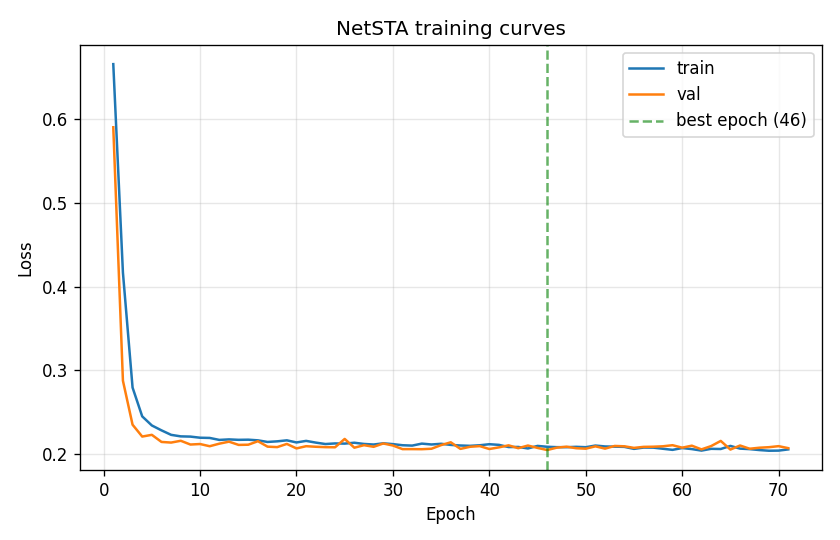
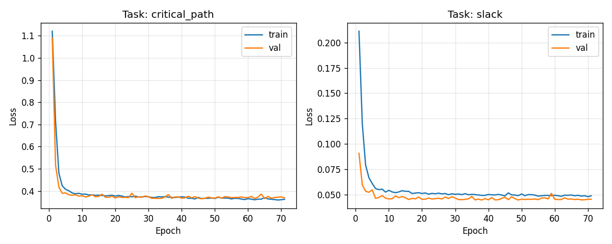
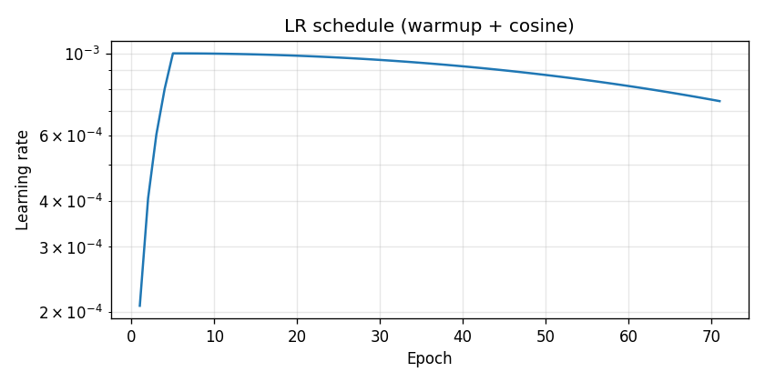

# NetSTA Benchmark Report

## Executive summary

NetSTA hits Slack R² = 0.642 and CP F1 = 0.505 on the standard 1000-circuit benchmark. Across 5 seeds the headline R² has σ = 0.052, so the result is reproducible rather than a lucky seed. At 1000 gates the GNN is 1.4x slower than the classical STA reference.

## Baseline Comparison

_Dataset: 1000 circuits, seed 42, 700/150/150 split._

| Model | Params | Slack MSE ↓ | Slack R² ↑ | CP Accuracy ↑ | CP F1 ↑ | CP AUC ↑ | Train Time | Infer Time/circuit |
| --- | --- | --- | --- | --- | --- | --- | --- | --- |
| Linear Regression | -- | 0.0566 | 0.590 | 84.2% | 0.480 | 0.942 | 7.6s | 0.01ms |
| Random Forest | -- | 0.0567 | 0.590 | 84.2% | 0.479 | 0.942 | 4.4s | 0.66ms |
| MLP | 78K | 0.0425 | 0.692 | 85.8% | 0.505 | 0.948 | 143.7s | 0.12ms |
| GCN | 406K | 0.0483 | 0.650 | 86.9% | 0.523 | 0.954 | 113.3s | 0.29ms |
| GraphSAGE | 668K | 0.0486 | 0.648 | 86.3% | 0.513 | 0.951 | 51.0s | 0.19ms |
| **NetSTA** | 472K | 0.0494 | 0.642 | 85.8% | 0.505 | 0.953 | 118.6s | 0.48ms |

**Takeaway:** NetSTA reaches Slack R² = 0.642, CP F1 = 0.505 with 472K parameters. Compare to the linear baseline floor and the graph-blind MLP to gauge how much of the lift comes from message passing vs attention.

## Robustness (5-seed)

_Trained NetSTA across 5 seeds: [42, 123, 456, 789, 1024]._
_Each: 1000 circuits, 200 epochs (early-stop), seed-specific split._

| Metric | Seed 42 | Seed 123 | Seed 456 | Seed 789 | Seed 1024 | Mean ± Std |
| --- | --- | --- | --- | --- | --- | --- |
| Slack MSE | 0.0480 | 0.0425 | 0.0526 | 0.0645 | 0.0474 | 0.0510 ± 0.0075 |
| Slack R² | 0.653 | 0.699 | 0.613 | 0.552 | 0.674 | 0.638 ± 0.052 |
| CP Accuracy | 86.4% | 85.1% | 87.2% | 86.7% | 85.5% | 86.2% ± 0.8% |
| CP F1 | 0.512 | 0.478 | 0.521 | 0.525 | 0.498 | 0.507 ± 0.017 |
| CP AUC-ROC | 0.952 | 0.953 | 0.955 | 0.953 | 0.952 | 0.953 ± 0.001 |

**Takeaway:** Across seeds: Slack R² = 0.638 ± 0.052, CP F1 = 0.507 ± 0.017, Slack MSE = 0.0510 ± 0.0075. Variance gives a rough confidence band on the headline numbers.

## Scaling

## Data scaling

| |train| | Slack MSE | Slack R² | CP Accuracy | CP F1 | CP AUC |
| --- | --- | --- | --- | --- | --- |
| 100 | 0.0481 | 0.664 | 85.1% | 0.491 | 0.949 |
| 250 | 0.0455 | 0.683 | 85.3% | 0.495 | 0.952 |
| 500 | 0.0447 | 0.688 | 85.7% | 0.502 | 0.953 |
| 1000 | 0.0462 | 0.678 | 86.3% | 0.512 | 0.953 |
| 1500 | 0.0443 | 0.691 | 86.2% | 0.511 | 0.954 |
| 2000 | ERR | ERR | ERR | ERR | ERR |

## Inference scaling: classical STA vs NetSTA GNN

| Circuit Size (gates) | Classical STA (ms) | NetSTA GNN (ms) | Speedup |
| --- | --- | --- | --- |
| 20 | 0.14 | 6.34 | 0.0x |
| 50 | 0.22 | 6.15 | 0.0x |
| 100 | 0.36 | 6.68 | 0.1x |
| 200 | 0.85 | 6.39 | 0.1x |
| 500 | 2.34 | 7.38 | 0.3x |
| 1000 | 4.65 | 6.62 | 0.7x |

**Takeaway:** At 1000 gates the GNN is 1.4x slower than classical STA (6.62ms vs 4.65ms). See data_scaling.png for how R²/F1 evolve with training-set size.

## Ablation

_Reference: Full Model (reference). 1000 circuits, seed 42._

| Configuration | Slack MSE | Δ MSE | Slack R² | Δ R² | CP Acc | Δ Acc | CP F1 | Δ F1 |
| --- | --- | --- | --- | --- | --- | --- | --- | --- |
| Full Model (reference) | 0.0483 | — | 0.650 | — | 86.2% | — | 0.511 | — |
| No edge features | 0.0480 | -0.0003 | 0.652 | +0.0019 | 85.4% | -0.8% | 0.498 | -0.0133 |
| No residual connections | 0.0481 | -0.0002 | 0.652 | +0.0015 | 85.9% | -0.3% | 0.508 | -0.0035 |
| No attention | 0.0489 | +0.0006 | 0.646 | -0.0042 | 86.5% | +0.3% | 0.517 | +0.0052 |
| 2 layers | 0.0485 | +0.0002 | 0.649 | -0.0016 | 86.6% | +0.4% | 0.518 | +0.0068 |
| 6 layers | 0.0485 | +0.0002 | 0.649 | -0.0017 | 86.4% | +0.2% | 0.515 | +0.0034 |
| No gate type features | 0.1431 | +0.0948 | -0.036 | -0.6865 | 71.8% | -14.3% | 0.288 | -0.2236 |
| No load capacitance | 0.0482 | -0.0001 | 0.651 | +0.0010 | 86.0% | -0.2% | 0.509 | -0.0023 |
| Single task (slack only) | 0.0470 | -0.0013 | 0.660 | +0.0096 | -- | -- | -- | -- |

**Takeaway:** Largest R² regression comes from 'No gate type features' (Δ = -0.687 R²), which is the biggest single-knob contributor to NetSTA's performance.

## Generalization

Tests how well NetSTA transfers across three distribution shifts.

| Generalization Test | Train R² | Test R² | Δ R² | Train CP Acc | Test CP Acc | Δ Acc |
| --- | --- | --- | --- | --- | --- | --- |
| Size (small→large) | 0.597 | 0.229 | -0.369 | 85.4% | 82.7% | -2.7% |
| Topology (subset→full) | 0.515 | 0.458 | -0.058 | 86.1% | 82.0% | -4.0% |
| Depth (shallow→deep) | 0.706 | 0.274 | -0.432 | 87.0% | 80.2% | -6.7% |

**Takeaway:** Size (small→large): train R² 0.597 → test R² 0.229 (Δ -0.369) | Topology (subset→full): train R² 0.515 → test R² 0.458 (Δ -0.058) | Depth (shallow→deep): train R² 0.706 → test R² 0.274 (Δ -0.432)

## Training Curves

**Takeaway:** Reference run best epoch = 46 (val loss 0.2048). Final test metrics: {'loss': 0.21546556204557418, 'slack_loss': 0.04554094970226288, 'critical_path_loss': 0.3853901743888855, 'per_task_metrics': {'slack': {'mse': 0.04773264189371192, 'mae': 0.09503260574891853, 'r2': 0.6543766176399529, 'pearson': 0.809756321180136}, 'critical_path': {'accuracy': 0.8620577734501785, 'precision': 0.34459459459459457, 'recall': 0.9793205317577548, 'f1': 0.5098039215686274, 'auc_roc': 0.9521346286424534, 'best_threshold': 0.556554655730545}}}.
