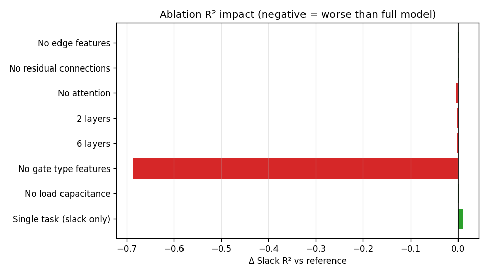

# NetSTA Ablation Study

_Reference: Full Model (reference). 1000 circuits, seed 42._

| Configuration | Slack MSE | Δ MSE | Slack R² | Δ R² | CP Acc | Δ Acc | CP F1 | Δ F1 |
| --- | --- | --- | --- | --- | --- | --- | --- | --- |
| Full Model (reference) | 0.0483 | — | 0.650 | — | 86.2% | — | 0.511 | — |
| No edge features | 0.0480 | -0.0003 | 0.652 | +0.0019 | 85.4% | -0.8% | 0.498 | -0.0133 |
| No residual connections | 0.0481 | -0.0002 | 0.652 | +0.0015 | 85.9% | -0.3% | 0.508 | -0.0035 |
| No attention | 0.0489 | +0.0006 | 0.646 | -0.0042 | 86.5% | +0.3% | 0.517 | +0.0052 |
| 2 layers | 0.0485 | +0.0002 | 0.649 | -0.0016 | 86.6% | +0.4% | 0.518 | +0.0068 |
| 6 layers | 0.0485 | +0.0002 | 0.649 | -0.0017 | 86.4% | +0.2% | 0.515 | +0.0034 |
| No gate type features | 0.1431 | +0.0948 | -0.036 | -0.6865 | 71.8% | -14.3% | 0.288 | -0.2236 |
| No load capacitance | 0.0482 | -0.0001 | 0.651 | +0.0010 | 86.0% | -0.2% | 0.509 | -0.0023 |
| Single task (slack only) | 0.0470 | -0.0013 | 0.660 | +0.0096 | -- | -- | -- | -- |

