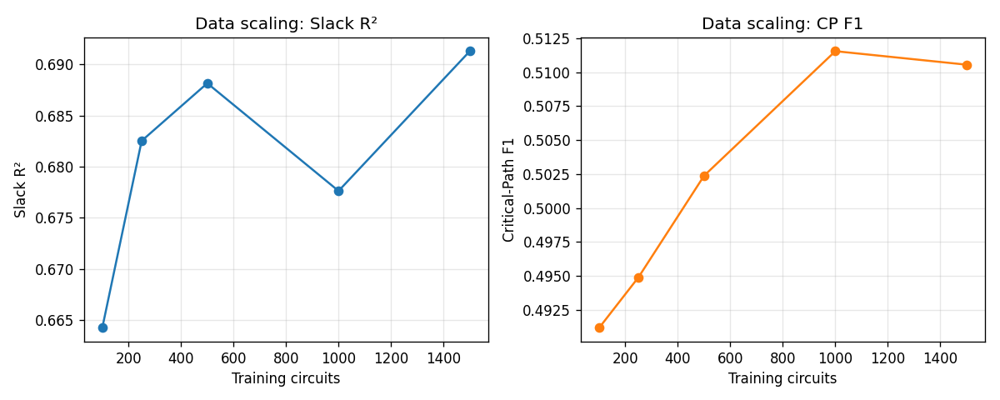
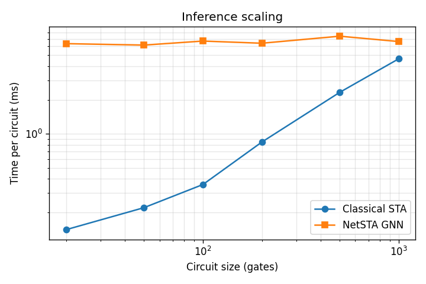

# NetSTA Scaling Analysis

## Data scaling

| |train| | Slack MSE | Slack R² | CP Accuracy | CP F1 | CP AUC |
| --- | --- | --- | --- | --- | --- |
| 100 | 0.0481 | 0.664 | 85.1% | 0.491 | 0.949 |
| 250 | 0.0455 | 0.683 | 85.3% | 0.495 | 0.952 |
| 500 | 0.0447 | 0.688 | 85.7% | 0.502 | 0.953 |
| 1000 | 0.0462 | 0.678 | 86.3% | 0.512 | 0.953 |
| 1500 | 0.0443 | 0.691 | 86.2% | 0.511 | 0.954 |
| 2000 | ERR | ERR | ERR | ERR | ERR |

## Inference scaling: classical STA vs NetSTA GNN

| Circuit Size (gates) | Classical STA (ms) | NetSTA GNN (ms) | Speedup |
| --- | --- | --- | --- |
| 20 | 0.14 | 6.34 | 0.0x |
| 50 | 0.22 | 6.15 | 0.0x |
| 100 | 0.36 | 6.68 | 0.1x |
| 200 | 0.85 | 6.39 | 0.1x |
| 500 | 2.34 | 7.38 | 0.3x |
| 1000 | 4.65 | 6.62 | 0.7x |

